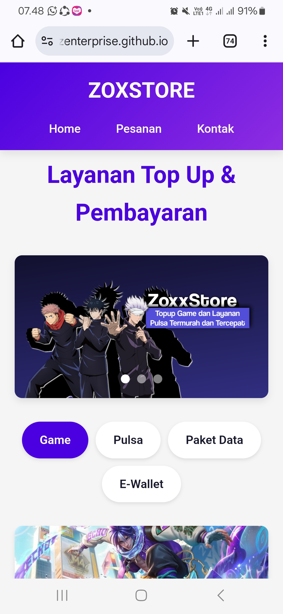

# README - ZoxxStore Top Up & Pembayaran

## Deskripsi Proyek
ZoxxStore adalah sebuah website untuk melakukan top up game dan pembelian pulsa/paket data/e-wallet. Website ini menyediakan berbagai produk digital dengan antarmuka yang user-friendly.

## Fitur Utama
1. **Kategori Produk**:
   - Game (Mobile Legends, Free Fire, PUBG Mobile, dll)
   - Pulsa (Telkomsel, Indosat, XL, dll)
   - Paket Data (Coming Soon)
   - E-Wallet (DANA, OVO, Gopay, ShopeePay)

2. **Fitur Unggulan**:
   - Banner slider untuk promo
   - Navigasi kategori yang mudah
   - Formulir pemesanan yang dinamis (menyesuaikan dengan produk yang dipilih)
   - Integrasi WhatsApp untuk konfirmasi pesanan
   - Responsive design (mobile-friendly)

3. **Teknologi yang Digunakan**:
   - HTML5
   - CSS3 (dengan variabel CSS untuk theming)
   - JavaScript (untuk interaktivitas)
   - Font Awesome (untuk ikon)
   - Google Fonts (Segoe UI)

## Cara Menggunakan
1. **Memilih Produk**:
   - Pilih kategori dari tab menu (Game, Pulsa, Paket Data, E-Wallet)
   - Klik produk yang ingin dibeli
   - Klik tombol "Pilih"

2. **Mengisi Formulir**:
   - Isi data yang diperlukan sesuai produk:
     - Untuk game: ID Game dan Zone ID (jika diperlukan)
     - Untuk pulsa: Nomor HP
     - Untuk e-wallet: Nomor e-wallet
   - Pilih nominal yang diinginkan
   - Pilih metode pembayaran (DANA, GOPAY, atau Cash)

3. **Menyelesaikan Pesanan**:
   - Klik "Lanjutkan Pembayaran"
   - Anda akan diarahkan ke WhatsApp untuk konfirmasi pesanan
   - Ikuti instruksi lebih lanjut via WhatsApp

## Struktur File
- `index.html` - File utama yang berisi seluruh kode HTML, CSS, dan JavaScript
- `Ban1.png`, `Ban2.png`, `Ban3.png` - Gambar untuk banner promo
- Berbagai gambar produk (ML.jpg, FreeFire.jpg, Pubg.jpg, dll)
- Gambar metode pembayaran (Dana.png, Cash.png, Gopay.png)

## Data Produk
Produk dan harganya disimpan dalam objek JavaScript di dalam file. Setiap produk memiliki:
- Nama produk
- Tipe produk (game, pulsa, data, emoney)
- Jenis formulir yang digunakan
- Daftar item dengan nominal dan harga

## Customization
Anda dapat dengan mudah menyesuaikan:
1. **Warna Theme**:
   - Ubah variabel CSS di bagian `:root`
   ```css
   :root {
       --primary: #4a00e0;
       --secondary: #8e2de2;
       --dark: #1a1a2e;
       --light: #f1f1f1;
   }
   ```

2. **Produk**:
   - Tambahkan/ubah produk di objek `products` dalam JavaScript
   ```javascript
   const products = {
       mlbb: {
           name: "Mobile Legends Diamond",
           type: "game",
           formType: "mlbb",
           items: [
               { name: "Weekly Diamond Pass", amount: "pass", price: 27000 },
               // item lainnya...
           ]
       },
       // produk lainnya...
   };
   ```

3. **Kontak WhatsApp**:
   - Ganti nomor WhatsApp di semua link yang ada (cari `6285892971228`)

## Fitur JavaScript
1. **Banner Slider**:
   - Auto slide setiap 5 detik
   - Navigasi dengan dot indicator
   - Support touch swipe untuk mobile

2. **Hide Header on Scroll**:
   - Header akan menyembunyikan diri saat scroll down
   - Muncul kembali saat scroll up

3. **Dynamic Forms**:
   - Formulir akan menyesuaikan dengan produk yang dipilih

4. **WhatsApp Integration**:
   - Mengirim detail pesanan via WhatsApp secara otomatis

## Catatan
1. Untuk produk "Coming Soon", tombol Pilih tetap bisa diklik tetapi akan muncul peringatan bahwa produk belum tersedia.
2. Riwayat pesanan harus dicek langsung via WhatsApp karena tidak ada sistem database di website ini.
3. Website ini adalah frontend-only dan tidak memiliki backend. Semua transaksi dilakukan via WhatsApp.

## Screenshot

<div>

</div>

## Kontak
Untuk pertanyaan atau masalah, hubungi:
- WhatsApp: [6283843436974](https://wa.me/6283843436974)
